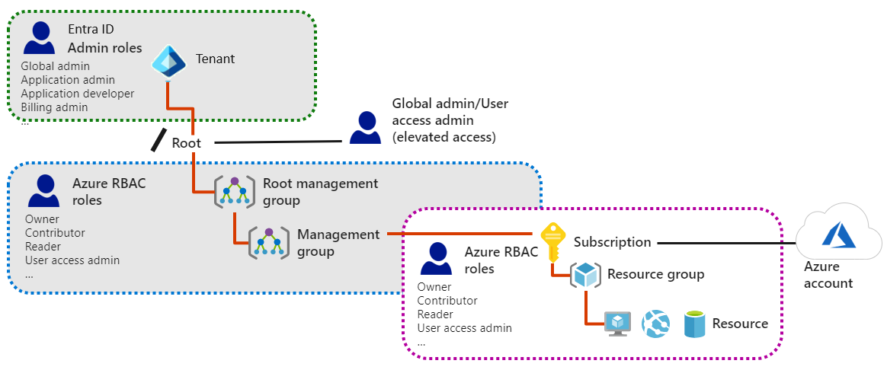

# Manage Identities and Governance

## Table of contents

- [Manage Identities and Governance](#manage-identities-and-governance)
  - [Entra ID](#entra-id)
    - [Usage](#usage)
    - [Entra ID vs Active Directory Domain Service](#entra-id-vs-active-directory-domain-service)
    - [Characteristics of AD DS](#characteristics-of-ad-ds)
    - [Compare Microsoft Entra ID P1 and P2 plans](#compare-microsoft-entra-id-p1-and-p2-plans)
    - [Entra ID Domain Service](#entra-id-domain-service)
  - [Configure user and group accounts](#configure-user-and-group-accounts)
    - [Create user accounts](#creat-user-accounts)
    - [Create group accounts](#create-group-accounts)
    - [Administrative units](#administative-units)
  - [Manage Subscriptions](#manage-subscriptions)
    - [Azure Region](#azure-region)
    - [Subscriptions](#subscriptions)
    - [Obtain a subscription](#obtain-a-subscription)
    - [Cost Management](#cost-management)
  - [Azure Policy](#azure-policy)
    - [Management Group](#management-group)
  - [Configure role-based access control](#configure-role-based-access-control)
    - [Role Definition](#role-definition)
    - [Role Assignment](#role-assignment)
  - [Create User and Group in Entra ID](#create-user-and-group-in-entra-id)
  - [Secure Resource with Azure RBAC](#secure-resource-with-azure-rbac)

## Manage Identities and Governance

Learn how to manage Azure Active Directory objects, role-based access control (RBAC), subscriptions, and governance in Azure.

### Entra ID

This module explains Microsoft Entra ID. You'll compare Microsoft Entra ID to Active Directory DS, learn about Microsoft Entra ID P1 and P2, and explore Microsoft Entra Domain Services for managing domain-joined devices and apps in the cloud.

Microsoft Entra ID is a cloud-based identity and access management service provided by Microsoft. Microsoft Entra ID is a comprehensive solution for managing identities, enforcing access policies, and securing your applications and data in the cloud and on-premises.

#### Usage:

- Configuring access to applications
- Configuring single sign-on (SSO) to cloud-based SaaS applications
- Managing users and groups
- Provisioning users
- Enabling federation between organizations
- Providing an identity management solution
- Identifying irregular sign-in activity
- Configuring multi-factor authentication
- Extending existing on-premises Active Directory implementations to Microsoft Entra ID
- Configuring Application Proxy for cloud and local applications
- Configuring Conditional Access for users and devices

Microsoft Entra constitutes a separate Azure service. Its most elementary form, which any new Azure subscription includes automatically, doesn't incur any extra cost and is referred to as the Free tier. If you subscribe to any Microsoft Online business services (for example, Microsoft 365 or Microsoft Intune), you automatically get Microsoft Entra ID with access to all the Free features.

At any given time, an Azure subscription must be associated with one, and only one, Microsoft Entra tenant. This association allows you to grant permissions to resources in the Azure subscription (via RBAC) to users, groups, and applications that exist in that particular Microsoft Entra tenant.

- Note:
  You can associate the same Microsoft Entra tenant with multiple Azure subscriptions. This allows you to use the same users, groups, and applications to manage resources across multiple Azure subscriptions

#### Entra ID vs Active Directory Domain Service:

- Implementing Microsoft Entra ID isn't the same as deploying virtual machines in Azure, adding AD DS, and then deploying some domain controllers for a new forest and domain. Microsoft Entra ID is a different service, much more focused on providing identity management services to web-based apps, unlike AD DS, which is more focused on on-premises apps.
- Unlike AD DS, Microsoft Entra ID is multi-tenant by design and is implemented specifically to ensure isolation between its individual directory instances.
- The Microsoft Entra schema contains fewer object types than that of AD DS. Most notably, it doesn't include a definition of the computer class, although it does include the device class. The process of joining devices to Microsoft Entra differs considerably from the process of joining computers to AD DS. The Microsoft Entra schema is also easily extensible, and its extensions are fully reversible.
  The lack of support for the traditional computer domain membership means that you can't use Microsoft Entra ID to manage computers or user settings by using traditional management techniques,such as Group Policy Objects (GPOs).
- Microsoft Entra ID doesn't include the organizational unit (OU) class, which means that you can't arrange its objects into a hierarchy of custom containers, which is frequently used in on-premises AD DS deployments. However, this isn't a significant shortcoming, because OUs in AD DS are used primarily for Group Policy scoping and delegation. You can accomplish equivalent arrangements by organizing objects based on their group membership.

Entra ID include two parts:
1- Object of the Applications: An object in the Application class contains an application definition.
2- servicePrincipal classes: An object in the servicePrincipal class constitutes its instance in the current Microsoft Entra tenant.
Separating these two sets of characteristics allows you to define an application in one tenant and ,use it across multiple tenants by creating a service principal object for this application in each tenant. Microsoft Entra ID creates the service principal object when you register the corresponding application in that Microsoft Entra tenant.

##### Characteristics of AD DS:

- AD DS is a true directory service, with a hierarchical X.500-based structure.
- AD DS uses Domain Name System (DNS) for locating resources such as domain controllers.
- You can query and manage AD DS by using Lightweight Directory Access Protocol (LDAP) calls.
- AD DS primarily uses the Kerberos protocol for authentication.
- AD DS uses OUs and GPOs for management.
- AD DS includes computer objects, representing computers that join an Active Directory domain.
- AD DS uses trusts between domains for delegated management.

You can deploy AD DS on an Azure virtual machine to enable scalability and availability for an on-premises AD DS. However, deploying AD DS on an Azure virtual machine doesn't make any use of Microsoft Entra ID.

##### Characteristics of Microsoft Entra ID:

- Microsoft Entra ID is primarily an identity solution, and it’s designed for internet-based applications by using HTTP (port 80) and HTTPS (port 443) communications.
- Microsoft Entra ID is a multi-tenant directory service.
- Microsoft Entra users and groups are created in a flat structure, and there are no OUs or GPOs.
- You can't query Microsoft Entra ID by using LDAP; instead, Microsoft Entra ID uses the REST API over HTTP and HTTPS.
- Microsoft Entra ID doesn't use Kerberos authentication; instead, it uses HTTP and HTTPS protocols such as SAML, WS-Federation, and OpenID Connect for authentication, and uses OAuth for authorization.
- Microsoft Entra ID includes federation services, and many third-party services such as Facebook are federated with and trust Microsoft Entra ID.

When you deploy cloud services such as Microsoft 365 or Intune, you also need to have directory services in the cloud to provide authentication and authorization for these services. Because of this, each cloud service that needs authentication will create its own Microsoft Entra tenant. When a single organization uses more than one cloud service, it’s much more convenient for these cloud services to use a single cloud directory instead of having separate directories for each service.

In particular, you can enable Microsoft Entra authentication for the Web Apps feature of Azure App Service directly from the Authentication/Authorization blade in the Azure portal. By designating the Microsoft Entra tenant, you can ensure that only users with accounts in that directory can access the website. It’s possible to apply different authentication settings to individual deployment slots.

#### Compare Microsoft Entra ID P1 and P2 plans:

The Microsoft Entra ID P1 or P2 tier provides extra functionality as compared to the Free and Office 365 editions. However, premium versions require additional cost per user provisioning. Microsoft Entra ID P1 or P2 comes in two versions P1 and P2. You can procure it as an extra license or as a part of the Microsoft Enterprise Mobility + Security, which also includes the license for Azure Information Protection and Intune.

Microsoft provides a free trial period that can be used to experience the full functionality of the Microsoft Entra ID P2 edition. The following features are available with the Microsoft Entra ID P1 edition:

- Self-service group management. It simplifies the administration of groups where users are given the rights to create and manage the groups. End users can create requests to join other groups, and group owners can approve requests and maintain their groups’ memberships.
- Advanced security reports and alerts. You can monitor and protect access to your cloud applications by viewing detailed logs that show advanced anomalies and inconsistent access pattern reports. Advanced reports are machine learning based and can help you gain new insights to improve access security and respond to potential threats.
- Multi-factor authentication. Full multi-factor authentication (MFA) works with on-premises applications (using virtual private network -VPN-, RADIUS, and others), Azure, Microsoft 365, Dynamics 365, and third-party Microsoft Entra gallery applications. It doesn't work with non-browser off-the-shelf apps, such as Microsoft Outlook. Full multi-factor authentication is covered in more detail in the following units in this lesson.
- Microsoft Identity Manager (MIM) licensing. MIM integrates with Microsoft Entra ID P1 or P2 to provide hybrid identity solutions. MIM can bridge multiple on-premises authentication stores such as AD DS, LDAP, Oracle, and other applications with Microsoft Entra ID. This provides consistent experiences to on-premises line-of-business (LOB) applications and SaaS solutions.
- Enterprise SLA of 99.9%. You're guaranteed at least 99.9% availability of the Microsoft Entra ID P1 or P2 service. The same SLA applies to Microsoft Entra Basic.
- Password reset with writeback. Self-service password reset follows the Active Directory on-premises password policy.
- Cloud App Discovery feature of Microsoft Entra ID. This feature discovers the most frequently used cloud-based applications.
- Conditional Access based on device, group, or location. This lets you configure conditional access for critical resources, based on several criteria.
- Microsoft Entra Connect Health. You can use this tool to gain operational insight into Microsoft Entra ID. It works with alerts, performance counters, usage patterns, and configuration settings, and presents the collected information in the Microsoft Entra Connect Health portal.

In addition to these features, the Microsoft Entra ID P2 license provides extra functionalities:

- Microsoft Entra ID Protection. This feature provides enhanced functionalities for monitoring and protecting user accounts. You can define user risk policies and sign-in policies. In addition, you can review users’ behavior and flag users for risk.
- Microsoft Entra Privileged Identity Management. This functionality lets you configure additional security levels for privileged users such as administrators. With Privileged Identity Management, you define permanent and temporary administrators. You also define a policy workflow that activates whenever someone wants to use administrative privileges to perform some task.

#### Entra ID Domain Service:

To move AD DS authentication for line-of-business applications from on-premise into Azure, Entra ID DS is the option. Which is part of Entra ID P1 and P2 tier. It provides domain services such as Group Policy management, domain joining, and Kerberos authentication to your Microsoft Entra tenant. These services are fully compatible with locally deployed AD DS, so you can use them without deploying and managing additional domain controllers in the cloud.
Because Microsoft Entra ID can integrate with your local AD DS, when you implement _Microsoft Entra Connect_, users can utilize organizational credentials in both on-premises AD DS and in Microsoft Entra Domain Services. Even if you don’t have AD DS deployed locally, you can choose to use Microsoft Entra Domain Services as a cloud-only service. This enables you to have similar functionality of locally deployed AD DS without having to deploy a single domain controller on-premises or in the cloud. For example, an organization can choose to create a Microsoft Entra tenant and enable Microsoft Entra Domain Services, and then deploy a virtual network between its on-premises resources and the Microsoft Entra tenant. You can enable Microsoft Entra Domain Services for this virtual network so that all on-premises users and services can use domain services from Microsoft Entra ID.

Microsoft Entra Domain Services provides several benefits for organizations, such as:

- Administrators don't need to manage, update, and monitor domain controllers.
- Administrators don't need to deploy and manage Active Directory replication.
- There’s no need to have Domain Admins or Enterprise Admins groups for domains that Microsoft Entra ID manages.

Limitations:

- Only the base computer Active Directory object is supported.
- It’s not possible to extend the schema for the Microsoft Entra Domain Services domain.
- The organizational unit (OU) structure is flat and nested OUs aren't currently supported.
- There’s a built-in Group Policy Object (GPO), and it exists for computer and user accounts.
- It’s not possible to target OUs with built-in GPOs. Additionally, you can't use Windows Management Instrumentation filters or security-group filtering.

By using Microsoft Entra Domain Services, you can freely migrate applications that use LDAP, NTLM, or the Kerberos protocols from your on-premises infrastructure to the cloud.

You can enable Microsoft Entra Domain Services by using the Azure portal. This service charges per hour based on the size of your directory.

### Configure user and group accounts

Every user who wants access to Azure resources needs an Azure user account. A user account has all the information required to authenticate the user during the sign-in process. Microsoft Entra ID supports three types of user accounts. The types indicate where the user is defined (in the cloud or on-premises), and whether the user is internal or external to your Microsoft Entra organization.

1- Cloud identity: A user account with a cloud identity is defined only in Microsoft Entra ID.
2- Directory-synchronized identity: User accounts that have a directory-synchronized identity are defined in an on-premises Active Directory. A synchronization activity occurs via Microsoft Entra Connect to bring these user accounts in to Azure. The source for these accounts is Windows Server Active Directory.
3- Guest user: Guest user accounts are defined outside Azure. Examples include user accounts from other cloud providers, and Microsoft accounts like an Xbox LIVE account. The source for guest user accounts is Invited user. Guest user accounts are useful when external vendors or contractors need access to your Azure resources.

#### Creat user accounts:

Create users one by one or bulk with a csv emplate.

#### Create group accounts

Microsoft Entra ID allows your organization to define two different types of group accounts:
1- **Security groups** are used to manage member and computer access to shared resources for a group of users. You can create a security group for a specific security policy and apply the same permissions to all members of a group.
2- **Microsoft 365 groups** provide collaboration opportunities. Group members have access to a shared mailbox, calendar, files, SharePoint site, and more.

**Characteristics of group accounts:**

- _Add Microsoft 365 groups to enable group access for guest users outside your Microsoft Entra organization._
- Normal users and Microsoft Entra admins can both use Microsoft 365 groups.

**Three access rights**:
1- Assigned: Add specific users as members of a group, where each user can have unique permissions.
2- Dynamic user: Use dynamic membership rules to automatically add and remove group members. When member attributes change, Azure reviews the dynamic group rules for the directory.
3- Dynamic device (Security groups only): Apply dynamic group rules to automatically add and remove devices in security groups. When device attributes change, Azure reviews the dynamic group rules for the directory.

#### Administative Units:

Restrict administrative scope by using administrative units for your organization. The division of roles and responsibilities is especially helpful for organizations that have many independent divisions.

### Manage Subscriptions:

#### Azure Region:

A region is a geographical area on the planet containing at least one, but potentially multiple datacenters. The datacenters are in close proximity and networked together with a low-latency network.
Most Azure regions are paired with another region within the same geography to make a regional pair (or paired regions). Regional pairs help to support always-on availability of Azure resources used by your infrastructure.

_Chatactrisitics:_

- **Physical isolation:** Microsoft preferes at least 300 miles of separation between datacenters in regional pair to reduce impact of power outages, natural disaster, civil unrest, or physical network outages on both regions at once.
- **Platform-provided replication:** Some services like Geo-Redundant Storage provide automatic replication to the paired region.
- **Region recovery order:** During a broad outage, recovery of one region is prioritized out of every pair. Applications that are deployed across paired regions are guaranteed to have one of the regions recovered with priority.
- **Sequential updates:** Planned Azure system updates are rolled out to paired regions sequentially (not at the same time). Rolling updates minimizes downtime, reduces bugs, and logical failures in the rare event of a bad update.
- **Data residency:** Regions reside within the same geography as their enabled set (except for the Brazil South and Singapore regions).

_Considerations_:

- Consider service support by region. Research region and service availability. Some services or Azure Virtual Machines features are available only in certain regions, such as specific Virtual Machines sizes or storage types.
- Consider services that don't require regions. Identify services that don't need region support. Some global Azure services that don't require you to select a region. These services include Microsoft Entra ID, Microsoft Azure Traffic Manager, and Azure DNS.
- Consider benefits of data residency. Take advantage of the benefits of data residency offered by regional pairs. This feature can help you meet requirements for tax and law enforcement jurisdiction purposes.

### Subscriptions:

An Azure subscription is a logical unit of Azure services that's linked to an Azure account. Subscriptions help you organize access to Azure cloud service resources, and help you control how resource usage is reported, billed, and paid.

_Things to Know:_

- Each subscription can have a different billing and payment configuration.
- If your Azure account is the only account associated with a subscription, you're responsible for the billing requirements.
- Billing for Azure services is done on a per-subscription basis.

### Obtain a subscription:

_Azure subscription Types:_
Free, Pay-As-You-Go, Enterprise Agreement, and Student.

- Consider trying Azure for free. An Azure free subscription includes a monetary credit to spend on any service for the first 30 days. You get free access to the most popular Azure products for 12 months, and access to more than 25 products that are always free. An Azure free subscription is an excellent way for new users to get started.
  - To set up a free subscription, you need a phone number, a credit card, and a Microsoft account.
  - The credit card information is used for identity verification only. You aren't charged for any services until you upgrade to a paid subscription.
- Consider paying monthly for used services. A Pay-As-You-Go (PAYG) subscription charges you monthly for the services you used in that billing period. This subscription type is appropriate for a wide range of users, from individuals to small businesses, and many large organizations as well.
- Consider using an Azure Enterprise Agreement. An Enterprise Agreement provides flexibility to buy cloud services and software licenses under one agreement. The agreement comes with discounts for new licenses and Software Assurance. This type of subscription targets enterprise-scale organizations.
- Consider supporting Azure for students. An Azure for Students subscription includes a monetary credit that can be used within the first 12 months.
  - Students can select free services without providing a credit card during the sign-up process.
  - You must verify your student status through your organizational email address.

### Cost Management

- Review the Microsoft Cost Management recommendations to learn how you can optimize and improve efficiency by identifying idle and underutilized resources. Recommendations can reveal less expensive resource options. When you act on the recommendations, you change the way you use your resources to save money. Using recommendations is an easy process:

1. View cost optimization recommendations to see potential usage inefficiencies.
2. Act on a recommendation to modify your Azure resource use and implement a more cost-effective option.
3. Verify the new action to make sure the change has the desired effect.

### Tag

- A resource or resource group can have a maximum of 50 tag name/value pairs.
- Tags applied to a resource group aren't inherited by the resources in the resource group.
- Retrieve related resources from other resource groups by searching on the tag name or value.
- Group resources like virtual machines by cost center and production environment. When you download the resource usage comma-separated values (CSV) file for your services, the tags appear in the Tags column.

### Apply cost savings

- **Reservation**: Save money by paying ahead. Pre-paying allows you to get a discount on the resources you use. Reservations can significantly reduce your virtual machine, SQL database compute, Azure Cosmos DB, or other resource costs up to 72% on pay-as-you-go prices. Reservations provide a billing discount and don't affect the runtime state of your resources.
- **Azure Hybrid Benefits**: Save on cost while optimizing your hybrid environment by applying your existing Windows Server, SQL Server licenses or Linux subscriptions to Azure Hybrid Benefit.
  Azure Hybrid Benefits helps maximize the value of existing on-premises Windows Server or SQL Server license investments when migrating to Azure. With using our own license on Azure services, We can can Azure and that utilizing software support (Azure, RedHat, SUSE) together and save up to 85% in costs. We can use our license on both on-premise and Azure simultaneously up to _180 days_ in migration period.
  Access pricing benefits if you have a license that includes [_**Software Assurance**_](./assets/Software-Assurance-Program-Guide.pdf). _Software Assurance_ includes an extensive set of technologies, services, rights, and benefits to help you and your organization get the most out of your investments in IT and can help you save time and money.
- **Azure Credits**: Use the monthly credit benefit to develop, test, and experiment with new solutions on Azure. As a Visual Studio subscriber, you could use Microsoft Azure at no extra charge. With your monthly Azure credit, Azure is your personal sandbox for development and testing.
- **Azure regions**: Compare pricing across regions. Pricing can vary from one region to another, even in the US.
- **Budgets**: Use budgets to compare and track spending as you analyze costs.
- **Pricing Calculator**: The _Pricing Calculator_ provides estimates in all areas of Azure, including compute, networking, storage, web, and databases.

### Azure Policy:

Azure Policy is a **service** in Azure that enables you to create, assign, and manage policies to control or audit your resources. These policies enforce different rules over your resource configurations so the configurations stay compliant with corporate standards.

#### Management Group:

Azure management groups provide a level of scope and control above your subscriptions

- By default, all new subscriptions are placed under the top-level management group, or root group.
- All subscriptions within a management group automatically **inherit** the conditions applied to that management group.
- A management group tree can support up to six levels of depth.
- Azure role-based access control authorization for management group operations isn't enabled by default.
- All subscriptions within a management group inherit the conditions applied to the management group. You can apply policies to a management group to limit the regions available for creating virtual machines (VMs).
- A management group has a directory unique identifier (ID) and a display name. The ID is used to submit commands on the management group. The ID value can't be changed after it's created because it's used throughout the Azure system to identify the management group. The display name for the management group is optional and can be changed at any time.

Advantages of _Management Group_:

- **Enforce rules and compliance**: Enable built-in policies, or build custom policies for all resource types. Support real-time policy evaluation and enforcement, and periodic or on-demand compliance evaluation.
- **Apply policies at scale**:Apply policies to a management group with control across your entire organization. Apply multiple policies and aggregate policy states with policy initiative. Define an exclusion scope.
- **Perform remediation**: Conduct real-time remediation, and remediation on your existing resources.

_Example_:

- You can enforce a required tag on resources and define the allowed values.
- You can specify the set of virtual machine SKUs that your organization can deploy.
- You can choose the geographic locations or regions that are available to your organization.

#### Create Azure Policy:

A **_policy definition_** describes the compliance conditions for a resource, and the actions to complete when the conditions are met. One or more policy definitions are grouped into an **_initiative definition_**, to control the scope of your policies and evaluate the compliance of your resources.

[Diff between _Azure Policy_ and _Azure Initiative_ in TechCommunity](https://techcommunity.microsoft.com/t5/itops-talk-blog/azure-policy-initiatives-vs-azure-policies-when-should-i-use-one/ba-p/1229167)

There are four basic steps to create and work with policy definitions in Azure Policy.

- **Step 1 Create policy definitions**:
  A policy definition expresses a condition to evaluate and the actions to perform when the condition is met. You can create your own policy definitions, or choose from built-in definitions in Azure Policy.
  To summarize, Azure policy is basically 3 components; **_policy definition_** , **_assignment_** and **_parameters_**.

  - _Policy definition_ is the conditions which you want controlled. There are built in definitions such as controlling what type of resources can be deployed to enforcing the use of tags on all resources.
  - _Policy assignment_ is the scope of what the policy definition can take effect around. Scope of assignment can be assigned to a individual, resource, resource group or management group. Policy assignments are inherited by all child resources.
  - _Policy parameters_ are used by reducing the number of policy definitions you must create. Parameters would be used to define which type of VM SKUs to deploy or defining a specific location.

  examples of built-in policy definitions:

  - Allowed virtual machine size SKUs
  - Allowed locations
  - Configure Azure Device Update for IoT Hub accounts to disable public network access

- **Step 2 Create an initiative definition**:
  An Azure initiative is a collection of Azure policy definitions that are grouped together towards a specific goal or purpose in mind. Azure initiatives simplify management of your policies by grouping a set of policies together as one single item. You can create your own initiative definitions, or use built-in definitions in Azure Policy. You can use an initiative definition to ensure resources are compliant with security regulations.
  When you create an initiative definition, be sure the definition uses the specific **JSON** format required by Azure.

  Here are some examples of built-in initiative definitions:

  - _Audit machines with insecure password security settings_: Use this initiative to deploy an audit policy to specified resources in your organization. The definition evaluates the resources to check for insecure password security settings. This initiative is located in the Guest Configuration category.
  - _Configure Windows machines to run Azure Monitor Agent and associate them to a Data Collection Rule_: Use this initiative to monitor and secure your Windows VMs, Virtual Machine Scale Sets, and Arc machines. The definition deploys the Azure Monitor Agent extension and associates the resources with a specified Data Collection Rule. This initiative is located in the Monitoring category.
  - _Configure Azure Defender to be enabled on SQL servers_: Enable Azure Defender on your Azure SQL Servers to detect anomalous activities indicating unusual and potentially harmful attempts to access or exploit databases. This initiative is located in the SQL category.

- **Step 3: Scope the initiative definition**:
  Azure Policy lets you control how your initiative definitions are applied to resources in your organization. You can limit the scope of an initiative definition to specific management groups, subscriptions, or resource groups.

- **Step 4: Determine compliance**

### Configure role-based access control:

Azure Administrators need to secure access to their Azure resources like virtual machines (VMs), websites, networks, and storage. Administrators need mechanisms to help them manage who can access their resources, and what actions are allowed.
Role-based access control (RBAC) is a mechanism that can help you **manage who can access your Azure resources**. RBAC lets you determine what operations specific users can do on specific resources, and control what areas of a resource each user can access.
Azure RBAC is an authorization system built on **Azure Resource Manager**. Azure RBAC provides fine-grained access management of resources in Azure.

Concepts:

- _Security principal_ (WHO): An object that represents something that requests access to resources. Ex:User, group, service principal, managed identity.
- _Role definition_ (What): A set of permissions that lists the allowed operations. Azure RBAC comes with built-in role definitions, but you can also create your own custom role definitions. Ex: Contributer, Reader, Owner, Administrator, User Access.
- _Scope_ (WHERE): The boundary for the requested level of access, or "how much" access is granted. Ex: Management group, subscription, resource group, resource
- _Role assignment_: An assignment attaches a role definition to a security principal at a particular scope. Users can grant the access described in a role definition by creating (attaching) an assignment for the role. Ex: Assign the Contributor role to a user scoped to a subscription

#### Role definition

A Role definition consists of sets of premission that are defined in JSON format. Permission sets such as _Action_, _NotAction_, _DataAction_, _NotDataAction_, _AssignableScopes_.

_Things to Know_:

- The Owner built-in role has the highest level of access privilege in Azure.
- The system subtracts NotActions permissions from Actions permissions to determine the effective permissions for a role.
- The AssignableScopes permissions for a role can be management groups, subscriptions, resource groups, or resources.

Role Scope:

- Scope a role as available for assignment in two subscriptions: "/subscriptions/c276fc76-9cd4-44c9-99a7-4fd71546436e", "/subscriptions/e91d47c4-76f3-4271-a796-21b4ecfe3624"

- Scope a role as available for assignment only in the Network resource group: "/subscriptions/c276fc76-9cd4-44c9-99a7-4fd71546436e/resourceGroups/Network"

- Scope a role as available for assignment for all requestors: "/"

Considerations:

- Consider limiting access scope. Assign your roles with the minimum level of scope required to perform the job duties.
- Consider controlling changes to data. Identify data or resources that should only be modified in specific scenarios and apply tight access control. Limit users to the least of amount of access they need to get their work done.
- Consider applying deny assignments. Determine if you need to implement the deny assignment feature. Similar to a role assignment, a deny assignment attaches a set of deny actions to a user, group, or service principal at a particular scope for the purpose of denying access.

#### Role assignment:

A role assignment is the process of scoping a role definition to limit permissions for a requestor, such as a user, group, service principal, or managed identity.

_Thigs to know_:

- A resource inherits role assignments from its parent resource.
- The effective permissions for a requestor are a combination of the permissions for the requestor's assigned roles, and the permissions for the roles assigned to the requested resources.

Compare Azure roles to Microsoft Entra roles:

Access management:
Azure RBAC roles: Manages access to Azure resources
Microsoft Entra ID roles: Manages access to Microsoft Entra resources

Scope assignment:
Azure RBAC roles: Scope can be specified at multiple levels, including management groups, subscriptions, resource groups, and resources
Microsoft Entra ID roles: Scope is specified at the tenant level

Role definitions:
Azure RBAC roles:Roles can be defined via the Azure portal, the Azure CLI, Azure PowerShell, Azure Resource Manager templates, and the REST API
Microsoft Entra ID roles: Roles can be defined via the Azure portal, the Azure CLI, Azure PowerShell, Azure Resource Manager templates, and the REST API

Built-in role definitions are defined for several categories of services, tasks, and users. You can assign built-in roles at different scopes to support various scenarios, and build custom roles from the base definitions.

Microsoft Entra ID also provides built-in roles to manage resources in Microsoft Entra ID, including users, groups, and domains. Microsoft Entra ID offers administrator roles that you can implement for your organization, such as Global admin, Application admin, and Application developer.

- Microsoft Entra admin roles are used to manage resources in Microsoft Entra ID, such as users, groups, and domains. These roles are defined for the Microsoft Entra tenant at the root level of the configuration.
- Azure RBAC roles provide more granular access management for Azure resources. These roles are defined for a requestor or resource and can be applied at multiple levels: the root, management groups, subscriptions, resource groups, or resources.

### Create User and Group in Entra ID:

What is User accounts in Entra ID:
A user's account access consists of the type of user, their role assignments, and their ownership of individual objects.

There are different types of user accounts in Microsoft Entra ID. Each type has a level of access specific to the scope of work expected to be done under each type of user account.
Administrators have the highest level of access, followed by the member user accounts in the Microsoft Entra organization. Guest users have the most restricted level of access.

Roles:

- Administrator roles in Microsoft Entra ID allow users elevated access to control who is allowed to do what. allow a user to create or edit users, assign administrative roles to others, reset user passwords, manage user licenses, and more.
- Memeber user: new person is joined to organization, have this native default roles. They can edit profile information.
- Guest user: When you invite someone to collaborate with your organization, you add them to your Microsoft Entra organization as a guest user. Then, you can either send an invitation email that contains a redemption link or send a direct link to an app you want to share. Guest users sign in with their own work, school, or social identities. By default, Microsoft Entra member users can invite guest users. Someone with the User Administrator role can disable this default. When you invite someone to collaborate with your organization, you add them to your Microsoft Entra organization as a guest user. Then, you can either send an invitation email that contains a redemption link or send a direct link to an app you want to share. Guest users sign in with their own work, school, or social identities. By default, Microsoft Entra member users can invite guest users. Someone with the User Administrator role can disable this default.

Create user: `az ad user create --dipalay-name displayName --password password --user-principal-name navid@email.com`
Delete: `az ad user delete --id navid@email.com`

_Microsoft Entra ID helps you to manage your cloud-based apps, on-premises apps, and resources by using your organization's groups._

There are different ways you can assign access rights:

- Direct assignment: Assign a user the required access rights by directly assigning a role that has those access rights.
- Group assignment: Assign a group the required access rights, and members of the group will inherit those rights.
- Rule-based assignment: Use rules to determine a group membership based on user or device properties. For a user account or device's group membership to be valid, the user or device must meet the rules. If the rules aren't met, the user account or device's group membership is no longer valid. The rules can be simple. You can select prewritten rules or write your own advanced rules.

#### Group:

dynamic assignment:
You can create attribute-based rules to enable dynamic membership for a group in Microsoft Entra ID, part of Microsoft Entra. Dynamic group membership adds and removes group members automatically using membership rules based on member attributes. Example: _The membership of this group now depends on whether the user is in the United States._

When the attributes of a user or a device change, the system evaluates all dynamic group rules in a directory to see if the change would trigger any group adds or removes. If a user or device satisfies a rule on a group, they're added as a member of that group. If they no longer satisfy the rule, they're removed. You can't manually add or remove a member of a dynamic group.

#### Microsoft Entra B2B:

You want the external team to collaborate with the internal developer team in a process that's easy and secure. With Microsoft Entra business to business (B2B), you can add people from other companies to your Microsoft Entra tenant as guest users.
If your organization has multiple Microsoft Entra tenants, you may also want to use Microsoft Entra B2B to give a user in tenant A access to resources in tenant B. Each Microsoft Entra tenant is distinct and separate from other Microsoft Entra tenants and has its own representation of identities and app registrations.
With Microsoft Entra B2B, you don't have to manage your external users' identities. The partner has the responsibility to manage its own identities on their tenant. External users continue to use their current identities to collaborate with your organization.
After you invite a user, their account is added to Microsoft Entra ID, with a guest user type.

##### Add guest users to an application:

### Secure Resource with Azure RBAC:

Who (Service Principal), What (Role definition), Where (Scope) => Role Assignment

### Self-service Password reset (SSPR):

A strong, two-method authentication policy is always applied to accounts with an administrator role, regardless of your configuration for other users.
The security-question method isn't available to accounts associated with an administrator role.

License requirements

There are three editions of Microsoft Entra ID: free, Premium P1, and Premium P2. The password-reset functionality you can use depends on your edition.
