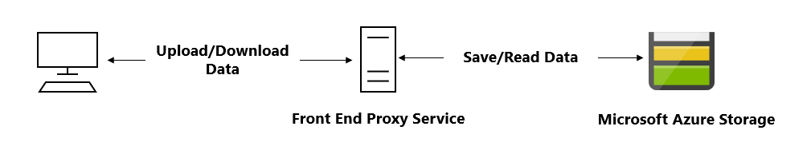
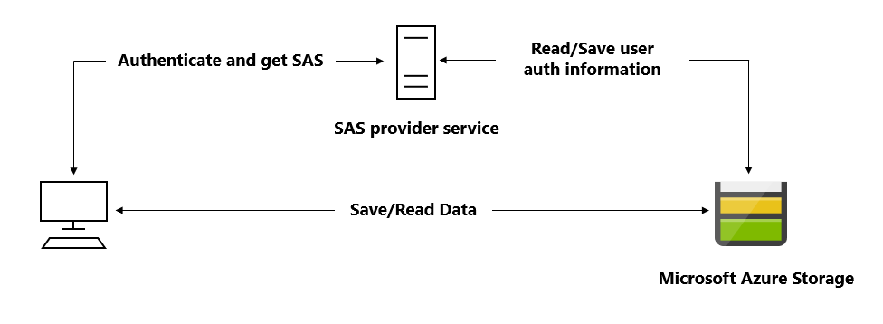
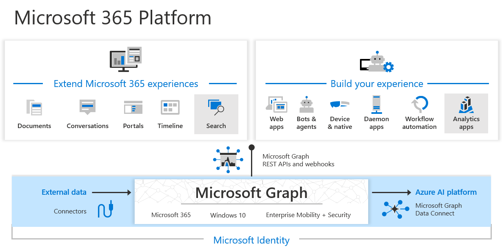

# User authentication and authorization

## Service Principals

To delegate Identity and Access Management functions to Microsoft Entra ID, an application must be registered with a Microsoft Entra tenant. When you register your application with Microsoft Entra ID, you're creating an identity configuration for your application that allows it to integrate with Microsoft Entra ID. When you register an app in the Azure portal, you choose whether it is:

- Single tenant: only accessible in your tenant
- Multi-tenant: accessible in other tenants

If you register an application in the portal:

1. an application object (the globally unique instance of the app)
2. and a service principal object are automatically created in your home tenant.

You also have a globally unique ID for your app (the app or client ID).

### Application object

A Microsoft Entra application is scoped to its one and only application object. The application object resides in the Microsoft Entra tenant where the application was registered (known as the application's "home" tenant). An application object is used as a template or blueprint to create one or more service principal objects. A service principal is created in every tenant where the application is used.

The application object describes three aspects of an application:

- How the service can issue tokens in order to access the application.
- Resources that the application might need to access.
- The actions that the application can take.

Service principal object

To access resources secured by a Microsoft Entra tenant, the entity that is requesting access must be represented by a security principal. This is true for both users (user principal) and applications (service principal).

The security principal defines the access policy and permissions for the user/application in the Microsoft Entra tenant. This enables core features such as authentication of the user/application during sign-in, and authorization during resource access.

Types of service principals:

- Application: This type of service principal is the local representation, or application instance, of a global application object in a single tenant or directory. A service principal is created in each tenant where the application is used, and references the globally unique app object. The service principal object defines what the app can actually do in the specific tenant, who can access the app, and what resources the app can access.
- Managed identity: Service principals representing managed identities can be granted access and permissions, but can't be updated or modified directly.
- Lagacy:

### Relationship between application objects and service principals

The application object is the global representation of your application for use across all tenants, and the service principal is the local representation for use in a specific tenant. The application object serves as the template from which common and default properties are derived for use in creating corresponding service principal objects.

An application object has:

- A one to one relationship with the software application, and
- A one to many relationships with its corresponding service principal objects.

A service principal must be created in each tenant where the application is used to establish an identity for sign-in and/or access to resources being secured by the tenant. A single-tenant application has only one service principal (in its home tenant), created and consented for use during application registration. A multitenant application also has a service principal created in each tenant where a user from that tenant consented to its use.

The Microsoft identity platform implements the OAuth 2.0 authorization protocol.

Permission types

The Microsoft identity platform supports two types of permissions: delegated access and app-only access.

- Delegated access are used by apps that have a signed-in user present. For these apps, either the user or an administrator consents to the permissions that the app requests. The app is delegated with the permission to act as a signed-in user when it makes calls to the target resource.
- App-only access permissions are used by apps that run without a signed-in user present, for example, apps that run as background services or daemons. Only an administrator can consent to app-only access permissions.

### conditional access

Conditional Access enables developers and enterprise customers to protect services in a multitude of ways including:

- Multifactor authentication
- Allowing only Intune enrolled devices to access specific services
- Restricting user locations and IP ranges

## Microsoft Authentication Library

MSLA.js

<https://learn.microsoft.com/en-us/entra/fundamentals/identity-fundamental-concepts?toc=%2Fentra%2Fidentity-platform%2Ftoc.json&bc=%2Fentra%2Fidentity-platform%2Fbreadcrumb%2Ftoc.json>

## shared access signatures

A shared access signature (SAS) is a signed URI that points to one or more storage resources and includes a token that contains a special set of query parameters. The token indicates how the resources might be accessed by the client. One of the query parameters, the signature, is constructed from the SAS parameters and signed with the key that was used to create the SAS. This signature is used by Azure Storage to authorize access to the storage resource.

### Types of shared access signatures

Azure Storage supports three types of shared access signatures:

- User delegation SAS: A user delegation SAS is secured with Microsoft Entra credentials and also by the permissions specified for the SAS. _A user delegation SAS applies to Blob storage only_.
- Service SAS: A service SAS is secured with the storage account key. A service SAS delegates access to a resource in the following Azure Storage services: Blob storage, Queue storage, Table storage, or Azure Files.
- Account SAS: An account SAS is secured with the storage account key. An account SAS delegates access to resources in one or more of the storage services. All of the operations available via a service or user delegation SAS are also available via an account SAS.

### How shared access signatures work

When you use a SAS to access data stored in Azure Storage, you need two components. The first is a URI to the resource you want to access. The second part is a SAS token that you've created to authorize access to that resource.

- URI: <https://medicalrecords.blob.core.windows.net/patient-images/patient-116139-nq8z7f.jpg>?
- SAS token: sp=r&st=2020-01-20T11:42:32Z&se=2020-01-20T19:42:32Z&spr=https&sv=2019-02-02&sr=b&sig=SrW1HZ5Nb6MbRzTbXCaPm%2BJiSEn15tC91Y4umMPwVZs%3D

sp=acdlrw
a: add
c: create
d: delete
l: list
r: read
w: write
st=2020-01-20T11:42:32Z: The date and time when access starts.
se=2020-01-20T19:42:32Z: The date and time when access ends. This example grants eight hours of access.
sv=2019-02-02 The version of the storage API to use.
sr=b The kind of storage being accessed. In this example, b is for blob.
sig=SrW1HZ5Nb6MbRzTbXCaPm%2BJiSEn15tC91Y4umMPwVZs%3D The cryptographic signature.

### Best practices

- The most secure SAS is a user delegation SAS. Use it wherever possible because it removes the need to store your storage account key in code. You must use Microsoft Entra ID to manage credentials. This option might not be possible for your solution.
- Try to set your expiration time to the smallest useful value. If a SAS key becomes compromised, it can be exploited for only a short time.
- There are some situations where a SAS isn't the correct solution. When there's an unacceptable risk of using a SAS, create a middle-tier service to manage users and their access to storage.

### when to use shared access signatures

A common scenario where a SAS is useful is a service where users read and write their own data to your storage account. In a scenario where a storage account stores user data, there are two typical design patterns:

- Clients upload and download data via a front-end proxy service, which performs authentication. This front-end proxy service has the advantage of allowing validation of business rules, but for large amounts of data or high-volume transactions, creating a service that can scale to match demand may be expensive or difficult.
  

- A lightweight service authenticates the client as needed and then generates a SAS. Once the client application receives the SAS, they can access storage account resources directly with the permissions defined by the SAS and for the interval allowed by the SAS. The SAS mitigates the need for routing all data through the front-end proxy service.
  

Many real-world services might use a hybrid of these two approaches. For example, some data might be processed and validated via the front-end proxy, while other data is saved and/or read directly using SAS.

Additionally, a SAS is required to authorize access to the source object in a copy operation in certain scenarios:

- When you copy a blob to another blob that resides in a different storage account, you must use a SAS to authorize access to the source blob. You can optionally use a SAS to authorize access to the destination blob as well.
- When you copy a file to another file that resides in a different storage account, you must use a SAS to authorize access to the source file. You can optionally use a SAS to authorize access to the destination file as well.
- When you copy a blob to a file, or a file to a blob, you must use a SAS to authorize access to the source object, even if the source and destination objects reside within the same storage account.

### stored access policies

A stored access policy provides an extra level of control over service-level shared access signatures (SAS) on the server side. Establishing a stored access policy groups SAS and provides more restrictions for signatures that bound by the policy. You can use a stored access policy to change the start time, expiry time, or permissions for a signature, or to revoke it after it is issued.

The following storage resources support stored access policies:

- Blob containers
- File shares
- Queues
- Tables

#### Creating a stored access policy

The access policy for a SAS consists of the start time, expiry time, and permissions for the signature. You can specify all of these parameters on the signature URI and none within the stored access policy; all on the stored access policy and none on the URI; or some combination of the two. However, you can't specify a given parameter on both the SAS token and the stored access policy.

```azurecli
az storage container policy create \
    --name <stored access policy identifier> \
    --container-name <container name> \
    --start <start time UTC datetime> \
    --expiry <expiry time UTC datetime> \
    --permissions <(a)dd, (c)reate, (d)elete, (l)ist, (r)ead, or (w)rite> \
    --account-key <storage account key> \
    --account-name <storage account name>
```

### Revoke a stored access policy

To revoke a stored access policy you can delete it, rename it by changing the signed identifier, or change the expiry time to a value in the past. Changing the signed identifier breaks the associations between any existing signatures and the stored access policy. Changing the expiry time to a value in the past causes any associated signatures to expire. Deleting or modifying the stored access policy immediately affects all of the SAS associated with it.

## Microsoft Graph

Microsoft Graph is the gateway to data and intelligence in Microsoft 365. It provides a unified programmability model that you can use to access the tremendous amount of data in Microsoft 365, Windows 10, and Enterprise Mobility + Security.



In the Microsoft 365 platform, three main components facilitate the access and flow of data:

- The Microsoft Graph API offers a single endpoint, <https://graph.microsoft.com>. You can use REST APIs or SDKs to access the endpoint. Microsoft Graph also includes a powerful set of services that manage user and device identity, access, compliance, security, and help protect organizations from data leakage or loss.
- Microsoft Graph connectors work in the incoming direction, delivering data external to the Microsoft cloud into Microsoft Graph services and applications, to enhance Microsoft 365 experiences such as Microsoft Search. Connectors exist for many commonly used data sources such as Box, Google Drive, Jira, and Salesforce.
- Microsoft Graph Data Connect provides a set of tools to streamline secure and scalable delivery of Microsoft Graph data to popular Azure data stores. The cached data serves as data sources for Azure development tools that you can use to build intelligent applications.

### Resource

Your URL includes the resource you're interacting with in the request, such as me, user, group, drive, and site. Often, top-level resources also include relationships, which you can use to access other resources, like me/messages or me/drive. You can also interact with resources using methods; for example, to send an email, use me/sendMail.

Each resource might require different permissions to access it. You often need a higher level of permissions to create or update a resource than to read it. For details about required permissions, see the method reference topic.

In scenario that an application needs to retrieve user data with Graph from Microsoft 365 resources such email, calendar, ... , applications request permission to access specific Microsoft 365 resources via Microsoft Graph. These requests can be made up front (when the application is registered) or dynamically (when the application is running). When an application requests permission, a user or administrator must consent to the permission before Microsoft Graph will authorize requests.

There are three main concepts to understand when your application needs to interact with Microsoft Graph:

- Microsoft Graph permissions or scopes
- Permission types
- Access tokens

Persmissions or scopes:
For example, User.Read.All grants an application the permission to read the profile of all users in a directory. To read the profile of a signed-in user, the permission required is User.Read.

Permission types:
There are two types of permissions in Microsoft Entra ID:

- Your application uses delegated permission when it's making a Microsoft Graph call on behalf of the user. The user can consent to some permission scopes, such as User.Read. But some permission scopes are highly privileged and require consent from an administrator.
  An example of a highly privileged permission scope is Channel.Delete.All, which deletes channels in any team on behalf of the signed-in user. The simplest example of a delegated permission scope is User.Read, which is required to call the /me endpoint. In Microsoft Graph, all API calls with /me use the currently signed-in user's context.
- Application permission doesn't require a signed-in user in the application. It's often used when a user isn't present, such as in a background process or to elevate permission. An administrator consents to the permission in advance.
  An example of an application permission scope is Calendars.ReadWrite, which allows the app to create, read, update, and delete events of all calendars without a signed-in user. You can't use a /me API for an application permission scope, because there's no signed-in user to pull out that information.

Access tokens:
After your application has requested permission, and a user or administrator has consented, the application can obtain an access token from the Microsoft identity platform.
