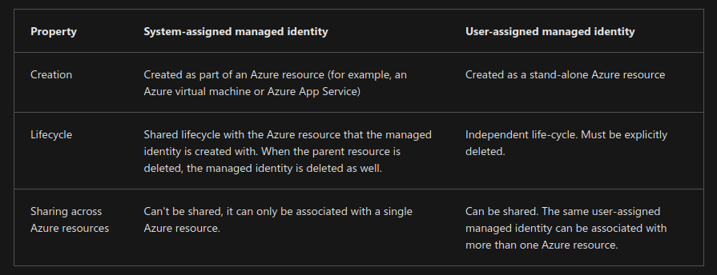

# Secure Azure solutions

The Azure Key Vault service supports two types of containers: vaults and managed hardware security module(HSM) pools. Vaults support storing software and HSM-backed keys, secrets, and certificates. Managed HSM pools only support HSM-backed keys.

Azure Key Vault helps solve the following problems:

<https://learn.microsoft.com/en-us/azure/key-vault/general/security-features>

- Secrets Management: Azure Key Vault can be used to Securely store and tightly control access to tokens, passwords, certificates, API keys, and other secrets
- Key Management: Azure Key Vault can also be used as a Key Management solution. Azure Key Vault makes it easy to create and control the encryption keys used to encrypt your data.
- Certificate Management: Azure Key Vault is also a service that lets you easily provision, manage, and deploy public and private Secure Sockets Layer/Transport Layer Security (SSL/TLS) certificates for use with Azure and your internal connected resources.

Azure Key Vault has two service tiers: Standard, which encrypts with a software key, and a Premium tier, which includes hardware security module(HSM)-protected keys, Azure Key Vaults may be either software-protected or, with the Azure Key Vault Premium tier, hardware-protected by hardware security modules (HSMs).

## Some security tips

- You can reduce the exposure of your vaults by specifying which IP addresses have access to them. The virtual network service endpoints for Azure Key Vault allow you to restrict access to a specified virtual network. After firewall rules are in effect, users can only read data from Key Vault when their requests originate from allowed virtual networks or IPv4 address ranges.

## Benefits

- Centralized application secrets: Your applications can securely access the information they need by using URIs. These URIs allow the applications to retrieve specific versions of a secret.
- Securely store secrets and keys (Access model):

  - Authentication is done via Microsoft Entra ID.
    Authorization may be done via Azure role-based access control (Azure RBAC) or Key Vault access policy.

  - Access to a key vault is controlled through two interfaces: the management plane and the data plane. The management plane is where you manage Key Vault itself. Operations in this plane include creating and deleting key vaults, retrieving Key Vault properties, and updating access policies. The data plane is where you work with the data stored in a key vault. You can add, delete, and modify keys, secrets, and certificates.

  - Both planes use Microsoft Entra ID for authentication. For authorization, the management plane uses Azure role-based access control (Azure RBAC) and the data plane uses a Key Vault access policy and Azure RBAC for Key Vault data plane operations.

- Monitor access and use: Azure Key Vault can be configured to:

  - Archive to a storage account.
  - Stream to an event hub.
  - Send the logs to Azure Monitor logs.

- Simplified administration of application secrets:
  - Automating certain tasks on certificates that you purchase from Public CAs, such as enrollment and renewal.

## Authentication

To do any operations with Key Vault, you first need to authenticate to it. There are three ways to authenticate to Key Vault:

- Managed identities for Azure resources: When you deploy an app on a virtual machine in Azure, you can assign an identity to your virtual machine that has access to Key Vault. You can also assign identities to other Azure resources. The benefit of this approach is that the app or service isn't managing the rotation of the first secret. Azure automatically rotates the service principal client secret associated with the identity. We recommend this approach as a best practice.
- Service principal and certificate: You can use a service principal and an associated certificate that has access to Key Vault. We don't recommend this approach because the application owner or developer must rotate the certificate.
- Service principal and secret: Although you can use a service principal and a secret to authenticate to Key Vault, we don't recommend it. It's hard to automatically rotate the bootstrap secret that's used to authenticate to Key Vault.

## Azure Key Vault best practices

- Use separate key vaults: Recommended using a vault per application per environment (Development, Pre-Production and Production). This pattern helps you not share secrets across environments and also reduces the threat if there is a breach.
- Control access to your vault
- Recovery options: Turn on soft-delete
- Logging
- Backup: Create regular back ups of your vault on update/delete/create of objects within a Vault.

Authentication best practices

We recommend that you use a managed identity for applications deployed to Azure. If you use Azure services that don't support managed identities or if applications are deployed on-premises, a service principal with a certificate is a possible alternative. In that scenario, the certificate should be stored in Key Vault and frequently rotated.

Use a service principal with a secret for development and testing environments. Use a user principal for local development and Azure Cloud Shell.

We recommend these security principals in each environment:

- Production environment: Managed identity or service principal with a certificate.
- Test and development environments: Managed identity, service principal with certificate, or service principal with a secret.
- Local development: User principal or service principal with a secret.

<https://learn.microsoft.com/en-us/azure/key-vault/general/developers-guide>

When to use **@azure/identity**:

The credential classes exposed by **@azure/identity** are focused on providing the most straightforward way to authenticate the Azure SDK clients locally, in your development environments, and in production.

Application requests to most Azure services must be authorized. Using the _DefaultAzureCredential_ method provided by the **Azure Identity client library** is the recommended approach for implementing passwordless connections to Azure services in your code. _DefaultAzureCredential_ supports multiple authentication methods and determines which method should be used at runtime. This approach enables your app to use different authentication methods in different environments (local vs. production) without implementing environment-specific code. DefaultAzureCredential automatically attempts to authenticate via multiple mechanisms, including environment variables or an interactive sign-in.

In this quickstart, _DefaultAzureCredential_ authenticates to key vault using the credentials of the local development user logged into the Azure CLI. When the application is deployed to Azure, the same _DefaultAzureCredential_ code can automatically discover and use a managed identity that is assigned to an App Service, Virtual Machine, or other services. For more information, see Managed Identity Overview.

The DefaultAzureCredential attempts to authenticate via the following mechanisms, in this order, stopping when one succeeds:

- Environment - The DefaultAzureCredential reads account information specified via environment variables and use it to authenticate.
- Managed Identity - If the application is deployed to an Azure host with Managed Identity enabled, the DefaultAzureCredential authenticates with that account.
- Visual Studio - If the developer authenticated via Visual Studio, the DefaultAzureCredential authenticates with that account.
- Azure CLI - If the developer authenticated an account via the Azure CLI az login command, the DefaultAzureCredential authenticates with that account. Visual Studio Code users can authenticate their development environment using the Azure CLI.
- Azure PowerShell - If the developer authenticated an account via the Azure PowerShell Connect-AzAccount command, the DefaultAzureCredential authenticates with that account.
- Interactive browser - If enabled, the DefaultAzureCredential interactively authenticates the developer via the current system's default browser. By default, this credential type is disabled.

- By default, when you create a new Azure Key Vault, no users (including the creator) have permissions to access or manage the secrets, keys, or certificates stored within it. This is a security measure to ensure that only explicitly granted users or applications can access the sensitive data.

```Bash
 az role assignment create --role "Key Vault Secrets Officer" --assignee <user-objectId $(az ad signed-in-user show --query id -o tsv) $(az ad user show  --id email@example.tld --query id -o tsv)> --scope $(az keyvault show --name kv-frc-demo -g rg-demo --query id -o tsv)
```

```TypeScript
import { DefaultAzureCredential } from "@azure/identity";
import { SecretClient } from "@azure/keyvault-secrets";
import { KeyClient } from "@azure/keyvault-keys";

const credential = new DefaultAzureCredential();
const client = new SecretClient(
  "https://kv-frc-demo.vault.azure.net/",
  credential
);

async function run() {
  const poll = await client.beginRecoverDeletedSecret("key-01");
  await poll.pollUntilDone();
  const saved = await client.setSecret("key-01", "navid");
  console.log(saved);

  const deletePoller = await client.beginDeleteSecret("key-01");
  await deletePoller.pollUntilDone();
  await client.purgeDeletedSecret("key-01");
}

run();
```

## Managed Identity

here are two types of managed identities:

- **A system-assigned managed identity** is enabled directly on an Azure service instance. When the identity is enabled, Azure creates an identity for the instance in the Microsoft Entra tenant trusted by the subscription of the instance. After the identity is created, the credentials are provisioned onto the instance. The lifecycle of a system-assigned identity is directly tied to the Azure service instance that it's enabled on. If the instance is deleted, Azure automatically cleans up the credentials and the identity in Microsoft Entra ID.
- **A user-assigned managed identity** is created as a standalone Azure resource. Through a create process, Azure creates an identity in the Microsoft Entra tenant that's trusted by the subscription in use. After the identity is created, the identity can be assigned to one or more Azure service instances. The lifecycle of a user-assigned identity is managed separately from the lifecycle of the Azure service instances to which it's assigned.

  

How a system-assigned managed identity works with an Azure virtual machine

1. Azure Resource Manager receives a request to enable the system-assigned managed identity on a virtual machine.

2. Azure Resource Manager creates a service principal in Microsoft Entra ID for the identity of the virtual machine. The service principal is created in the Microsoft Entra tenant that's trusted by the subscription.

3. Azure Resource Manager configures the identity on the virtual machine by updating the Azure Instance Metadata Service identity endpoint with the service principal client ID and certificate.

4. After the virtual machine has an identity, use the service principal information to grant the virtual machine access to Azure resources. To call Azure Resource Manager, use role-based access control in Microsoft Entra ID to assign the appropriate role to the virtual machine service principal. To call Key Vault, grant your code access to the specific secret or key in Key Vault.

5. Your code that's running on the virtual machine can request a token from the Azure Instance Metadata service endpoint, accessible only from within the virtual machine: <http://169.254.169.254/metadata/identity/oauth2/token>

6. A call is made to Microsoft Entra ID to request an access token (as specified in step 5) by using the client ID and certificate configured in step 3. Microsoft Entra ID returns a JSON Web Token (JWT) access token.

7. Your code sends the access token on a call to a service that supports Microsoft Entra authentication.

### Configure managed identities In Vm

```Bash
az vm create --resource-group myResourceGroup \ 
    --name myVM --image win2016datacenter \ 
    --generate-ssh-keys \ 
    --assign-identity \ 
    --role contributor \
    --scope mySubscription \
    --admin-username azureuser \ 
    --admin-password myPassword12
```

```Bash
az vm identity assign -g myResourceGroup -n myVm
```

```Bash
az identity create -g myResourceGroup -n myUserAssignedIdentity
```

``` Bash
az vm create \
--resource-group <RESOURCE GROUP> \
--name <VM NAME> \
--image Ubuntu2204 \
--admin-username <USER NAME> \
--admin-password <PASSWORD> \
--assign-identity <USER ASSIGNED IDENTITY NAME> \
--role <ROLE> \
--scope <SUBSCRIPTION>
```

```Bash
az vm identity assign \
    -g <RESOURCE GROUP> \
    -n <VM NAME> \
    --identities <USER ASSIGNED IDENTITY>
```

### Specify a user-assigned managed identity with DefaultAzureCredential

```csharp
string userAssignedClientId = "<your managed identity client Id>";
var credential = new DefaultAzureCredential(new DefaultAzureCredentialOptions { ManagedIdentityClientId = userAssignedClientId });
```

### Define a custom authentication flow with ChainedTokenCredential

While the _DefaultAzureCredential_ is generally the quickest way to get started developing applications for Azure, more advanced users may want to customize the credentials considered when authenticating. The _ChainedTokenCredential_ enables users to combine multiple credential instances to define a customized chain of credentials. This example demonstrates creating a ChainedTokenCredential which attempts to authenticate using managed identity, and fall back to authenticating via the Azure CLI if managed identity is unavailable in the current environment.

```csharp
var credential = new ChainedTokenCredential(new ManagedIdentityCredential(), new AzureCliCredential());
```

## Azure App Configuration
