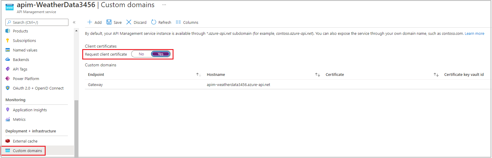

# API Mangement

<https://www.youtube.com/watch?v=K-tYU8GOUt0>

## Authentications Methods

### Subscriptions and Keys

A subscription key is a unique auto-generated key that can be passed through in the headers of the client request or as a query string parameter. The key is directly related to a subscription, which can be scoped to different areas. Subscriptions give you granular control over permissions and policies.

The three main subscription scopes are:

- All APIs: Applies to every API accessible from the gateway
- Single API: This scope applies to a single imported API and all of its endpoints
- Product: A product is a collection of one or more APIs that you configure in API Management. You can assign APIs to more than one product. Products can have different access rules, usage quotas, and terms of use.

### Secure APIs by using certificates

Certificates can be used to provide Transport Layer Security mutual (mLTS) authentication between the client and the API gateway.

Transport Layer Security client authentication:

With TLS client authentication, the API Management gateway can inspect the certificate contained within the client request and check for properties like

Certificate Authority (CA): Only allow certificates signed by a particular CA
Thumbprint: Allow certificates containing a specified thumbprint
Subject: Only allow certificates with a specified subject
Expiration Date: Only allow certificates that have not expired

These properties are not mutually exclusive and they can be mixed together to form your own policy requirements. For instance, you can specify that the certificate passed in the request is signed by a certain certificate authority and hasn't expired.

## Accepting client certificates in the Consumption tier

The Consumption tier in API Management is designed to conform with serverless design principals. If you build your APIs from serverless technologies, such as Azure Functions, this tier is a good fit. In the Consumption tier, you must explicitly enable the use of client certificates, which you can do on the Custom domains page. This step is not necessary in other tiers.



## Certificate Authorization Policies

Check the thumbprint of a client certificate

Every client certificate includes a thumbprint, which is a hash, calculated from other certificate properties. The thumbprint ensures that the values in the certificate have not been altered since the certificate was issued by the certificate authority.

Create these policies in the inbound processing policy file within the API Management gateway.

```xml
<choose>
    <when condition="@(context.Request.Certificate == null || context.Request.Certificate.Thumbprint != "desired-thumbprint")" >
        <return-response>
            <set-status code="403" reason="Invalid client certificate" />
        </return-response>
    </when>
</choose>
```

In the previous example, only one thumbprint would work so only one certificate would be validated. Usually, each customer or partner company would pass a different certificate with a different thumbprint. To support this scenario, obtain the certificates from your partners and use the Client certificates page in the Azure portal to upload them to the API Management resource.

```xml
<choose>
    <when condition="@(context.Request.Certificate == null || !context.Request.Certificate.Verify()  || !context.Deployment.Certificates.Any(c => c.Value.Thumbprint == context.Request.Certificate.Thumbprint))" >
        <return-response>
            <set-status code="403" reason="Invalid client certificate" />
        </return-response>
    </when>
</choose>
```

Check the issuer and subject of a client certificate:

```xml
<choose>
    <when condition="@(context.Request.Certificate == null || context.Request.Certificate.Issuer != "trusted-issuer" || context.Request.Certificate.SubjectName.Name != "expected-subject-name")" >
        <return-response>
            <set-status code="403" reason="Invalid client certificate" />
        </return-response>
    </when>
</choose>
```

## Create API Management

```azurecli
az apim create -n $myApiName \
    --location $myLocation \
    --publisher-email developer@matryx.io  \
    --resource-group az204-apim-rg \
    --publisher-name Matryx-Developers \
    --sku-name Consumption
```

## Policies

__NOTE__:
If the request contains `Authorization` header, the cache policy doesn't work.

### Caching Policy

```xml
<policies>
    <inbound>
        <base />
        <cache-lookup vary-by-developer="false" vary-by-developer-groups="false" downstream-caching-type="none" must-revalidate="true" caching-type="internal" />
    </inbound>
    <backend>
        <base />
    </backend>
    <outbound>
        <cache-store duration="60" />
        <base />
    </outbound>
    </on-error>
        <base />
    </on-error>
</policies>
```

#### By Value

```xml
<policies>
    <inbound>
        <cache-lookup-value key="12345"
            default-value="$0.00"
            variable-name="boardPrice"
            caching-type="internal" />
        <base />
    </inbound>
    <backend>
        <base />
    </backend>
    <outbound>
        <cache-store-value key="12345"
            value="$3.60"
            duration="3600"
            caching-type="internal" />
        <base />
    </outbound>
    </on-error>
        <base />
    </on-error>
</policies>
```

### Use vary-by tags

It's important to ensure that, if you serve a response from the cache, it's relevant to the original request. However, you also want to use the cache as much as possible. Suppose, for example, that the board games Stock Management API received a GET request to the following URL and cached the result:

http://<boardgames.domain>/stock/api/product?partnumber=3416&customerid=1128

This request is intended to check the stock levels for a product with part number 3416. The customer ID is used by a separate policy, and doesn't alter the response. Subsequent requests for the same part number can be served from the cache, as long as the record hasn't expired. So far, so good.

Now suppose that a different customer requests the same product:

http://<boardgames.domain>/stock/api/product?partnumber=3416&customerid=5238

By default, the response can't be served from the cache, because the customer ID is different.

However, the developers point out that the customer ID doesn't alter the response. It would be more efficient if requests for the same product from different customers could be returned from the cache. Customers would still see the correct information.

To modify this default behavior, use the vary-by-query-parameter element within the `<cache-lookup>` policy:

```xml
<policies>
    <inbound>
        <base />
        <cache-lookup vary-by-developer="false" vary-by-developer-groups="false" downstream-caching-type="none" must-revalidate="true" caching-type="internal">
            <vary-by-query-parameter>partnumber</vary-by-query-parameter>
        </cache-lookup>
    </inbound>
    <backend>
        <base />
    </backend>
    <outbound>
        <cache-store duration="60" />
        <base />
    </outbound>
    </on-error>
        <base />
    </on-error>
</policies>
```

By default, Azure API Management doesn't examine HTTP headers to determine whether a cached response is suitable for a given request. If a header can make a significant difference to a response, use the `<vary-by-header>` tag. Work with your developer team to understand how each API uses query parameters and headers so you can decide which vary-by tags to use in your policy.

Within the `<cache-lookup>` tag, there's also the vary-by-developer attribute, which is required and set to false by default. When this attribute is set to true, API Management examines the subscription key supplied with each request. It serves a response from the cache only if the original request had the same subscription key. Set this attribute to true when each user should see a different response for the same URL. If each user group should see a different response for the same URL, set the vary-by-developer-group attribute to true.

### Use an external cache

API Management instances usually have an internal cache, which is used to store prepared responses to requests. However, if you prefer, you can use a Redis-compatible external cache instead. One possible external cache system that you can use is the __Azure Cache for Redis service__.

You might choose to use an external cache because:

- You want to avoid the cache being cleared when the API Management service is updated.
- You want to have greater control over the cache configuration than the internal cache allows.
- You want to cache more data than can be stored in the internal cache.
- Avoid having your cache periodically cleared during API Management updates
- Have more control over your cache configuration
- Enable caching in the API Management self-hosted gateway
- Use caching with the Consumption tier of API Management:
    Another reason to configure an external cache is that you want to use caching with the Consumption pricing tier. This tier follows serverless design principles (stateless), and you should use it with serverless web APIs. For this reason, it has no internal cache. If you want to use caching with an API Management instance in the Consumption tier, you must use an external cache.

Consumption tier for API Management:  Azure configures API Management instances for this tier in just a minute or so. Other tiers can take up to 30 minutes or longer.

### Some examples

```xml
<outbount>
    <set-header-name name='x-powerred-by' exists-action="delete" />
    <redirect-content-urls />  <!-- mask body urls to apim url -->
    </base>
</outbound>
```

```xml
<rate-limit-by-key calls="10"
              renewal-period="60"
              increment-condition="@(context.Response.StatusCode == 200)"
              counter-key="@(context.Request.IpAddress)"/>
```

`<rate-limit-by-key` not available in consumption tier
