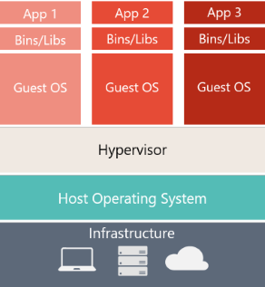

# Docker

/ˈdɒkə/ (noun) _a person employed in a port to load and unload ships._


## Table of contents:

- [Introduction](#introduction)
- [What is Container](#what-is-container)
- [Dawn of Docker](#Dawn-of-Docker)
- [Architecture](#architecture)
- [Networking](#networking)
  - [User-defined networks](#user-defined-networks)
  - [Drivers](#drivers)
  - [IP address and hostname](#ip-address-and-hostname)
  - [DNS services](#dns-services)
- [Volumes](#volume)

### Introduction:

Docker is an open-source platform that enables developers to build, deploy, run, update and manage containers.

### What is Container:

Containers are standardized, executable components that combine application source code with the operating system (OS) libraries and dependencies required to run that code in any environment. Containers simplify the development and delivery of distributed applications. They have become increasingly popular as organizations shift to cloud-native development and hybrid multicloud environments. Developers can create containers without Docker by working directly with capabilities built into Linux® and other operating systems, but Docker makes containerization faster and easier.

Docker plays a crucial role in modern software development, specifically microservices architecture.
In contrast to the traditional monolithic approach of a large, tightly coupled application, microservices provide a **cloud-native architectural** framework. This framework composes a single application from many smaller, **loosely coupled** and **independently deployable** smaller components or services. Each service can be containerized using Docker, simplifying deployment and allowing teams to roll out new versions and scale applications as needed.

**How do containers work?**
Containers are made possible by process isolation and virtualization capabilities built into the Linux kernel. These capabilities include control groups (Cgroups) for allocating resources among processes and namespaces for restricting a process's access or visibility into other resources or areas of the system.
Containers enable multiple application components to share the resources of a single instance of the host operating system. This sharing is similar to how a hypervisor allows multiple virtual machines (VMs) to share a single hardware server's central processing unit (CPU), memory and other resources.
Functions and Benefits:

- **Lighter weight**: Unlike VMs, containers don't carry the payload of an entire OS instance and hypervisor. They include just the OS processes and dependencies necessary to run the code.
- **Improved productivity and Protable**: Containerized applications can be written once and run anywhere. Compared to VMs, containers are quicker and easier to deploy, provision and restart.
- **Greater efficiency**: With containers, developers can run several times as many copies of an application on the same hardware as they can using VMs. This efficiency can reduce cloud spending.
- **Self-contained**. Each container has everything it needs to function with no reliance on any pre-installed dependencies on the host machine.
- **Isolated**. Since containers are run in isolation, they have minimal influence on the host and other containers, increasing the security of your applications.

 

Docker is the most widely used containerization tool, with an 82.84% market share. Docker is so popular today that "Docker" and "containers" are used interchangeably. However, the first container-related technologies were available for years—even decades—before Docker was publicly released as open source in 2013.

### Dawn of Docker:

**[2008] LXC by IBM**

_Linux Containers_, or LXC, is an advanced virtualization technology that utilizes key features of the Linux kernel to create lightweight and efficient isolated environments for running multiple applications on a single host system. This technology uses Linux kernel features, such as cgroups (control groups) and namespaces, to manage system resources and provide process isolation.

Key features of LXC:

- **Resource management with cgroups:** LXC manages resource allocation using cgroups, ensuring that each container has access to the resources it needs without impacting others, promoting efficient and stable performance.
- **Isolation with namespaces:** Namespaces ensure that containers are kept isolated from each other, preventing processes in one container from interfering with those in another. This feature enhances security and system reliability.

---

**[2013] Docker is here**

Docker, which launched in 2013, initially utilized LXC to provide an easier way to create, deploy, and run applications using containers. Docker quickly evolved from using LXC as its default execution environment by developing its own container runtime, libcontainer, which now powers Docker containers.

Although Docker started with LXC, it added significant value by layering tools and services that enhance user experience and management capabilities. Docker lets developers access these native containerization capabilities by using simple commands and automate them through a work-saving application programming interface (API).

Today, Docker containerization also works with Microsoft Windows Server and Apple MacOS.

**LXC use cases:**
LXC is not typically used for application development but for scenarios requiring full OS functionality or direct hardware integration. Its ability to provide isolated and secure environments with minimal overhead makes it suitable for infrastructure virtualization where traditional VMs might be too resource-intensive.

**Docker use cases:**
Docker excels in environments where deployment speed and configuration simplicity are paramount, making it an ideal choice for modern software development.

- Cloud migration
- Microservices architecture (microservices)
- CI/CD: Docker is ideal for continuous integration and continuous delivery (CI/CD) pipelines as it provides a consistent environment for testing and deploying applications, reducing possible errors during deployment.

#### Docker Strengths:

- **Streamlined deployment:** Docker packages applications into containers along with all their dependencies, ensuring consistent operation across any environment, from development through to production. This eliminates common deployment issues and enhances reliability.
- **Microservices architecture**: Docker supports the development, deployment, and scaling of microservices independently, enhancing application agility and system resilience. Its integration with Kubernetes further streamlines the orchestration of complex containerized applications, managing their deployment and scaling efficiently.

Although Docker and LXC are both powerful options for building containers, they serve different purposes and are suitable for different skill levels. Docker is designed for developers who want to quickly and efficiently build and deploy applications in various environments with minimal setup. On the other hand, LXC is more suitable for users who need a lightweight alternative to virtual machines and want more control over the operating system and hardware.

### Architecture:

_Docker uses a client/server architecture._

**Core components:**

- **Docker host:** A Docker host is a physical or virtual machine running Linux (or another Docker-Engine compatible OS).
- **Docker Engine:** Docker engine is a client/server application consisting of the Docker daemon, a Docker API that interacts with the daemon, and a command-line interface (CLI) that talks to the daemon.
- **Docker daemon:** Docker daemon is a service that creates and manages Docker images, by using the commands from the client. Essentially the Docker daemon serves as the control center for Docker implementation.
- **Docker client:** The Docker client provides the CLI that accesses the Docker API (a REST API) to communicate with the Docker daemon over Unix sockets or a network interface. The client can be connected to a daemon remotely, or a developer can run the daemon and client on the same computer system.
- **Docker objects:** Docker objects are components of a Docker deployment that help package and distribute applications. They include images, containers, networks, volumes, plug-ins and more.
- **Docker images:** Docker images contain executable application source code and all the tools, libraries and dependencies the application code needs to run as a container. When a developer runs the Docker image, it becomes one instance (or multiple instances) of the container.

  Building Docker images from scratch is possible, but most developers pull them down from common repositories. Developers can create multiple Docker images from a single base image and will share their stack's commonalities.

  Docker images are made up of layers, and each layer corresponds to a version of the image. Whenever a developer makes changes to an image, a new top layer is created, and this top layer replaces the previous top layer as the current version of the image. Previous layers are saved for rollbacks or to be reused in other projects.

  Each time a container is created from a Docker image, yet another new layer called the container layer is created. Changes made to the container—like adding or deleting files—are saved to the container layer, and these changes only exist while the container is running.

  Each layer represents a specific modification to the file system (inside the container), such as adding a new file or modifying an existing one. Once a layer is created, it becomes immutable, meaning it can't be changed. The layers of a Docker image are stored in the Docker engine's cache, which ensures the efficient creation of Docker images.

  

  This is beneficial because it allows layers to be reused between images. For example, imagine you wanted to create another Node.js application. Due to layering, you can leverage the same Node.js base. This will make builds faster and reduce the amount of storage and bandwidth required to distribute the images.

  

  Layers let you extend images of others by reusing their base layers, allowing you to add only the data that your application needs.

  Layering is made possible by content-addressable storage and union filesystems. While this will get technical, here’s how it works:

  1. After each layer is downloaded, it is extracted into its own directory on the host filesystem.
  2. When you run a container from an image, a union filesystem is created where layers are stacked on top of each other, creating a new and unified view.
  3. When the container starts, its root directory is set to the location of this unified directory, using chroot.

  When the union filesystem is created, in addition to the image layers, a directory is created specifically for the running container. This allows the container to make filesystem changes while allowing the original image layers to remain untouched. This enables you to run multiple containers from the same underlying image.

- **Docker containers:** Docker containers are the live, running instances of Docker images. While Docker images are read-only files, containers are live, ephemeral, executable content. Users can interact with them, and administrators can adjust their settings and conditions by using Docker commands.

- **Docker registry:** A Docker registry is a scalable, open-source storage and distribution system for Docker images. It enables developers to track image versions in repositories by using tagging for identification. This tracking and identification are accomplished by using Git, a version control tool.

- **Docker plug-ins:** Developers use plug-ins to make Docker Engine even more functional. Several Docker plugins supporting authorization, volume and network are included in the Docker Engine plug-in system; third-party plug-ins can be loaded as well.

- **Dockerfile:** Every Docker container starts with a simple text file containing instructions for how to build the Docker container image. Dockerfile automates the process of creating Docker images. It's essentially a list of CLI instructions that Docker Engine will run to assemble the image. Each instruction in a Dockerfile roughly translates to an image layer. The following diagram illustrates how a Dockerfile translates into a stack of layers in a container image.

  

  **Cached Layers:** When you run a build, the builder attempts to reuse layers from earlier builds. If a layer of an image is unchanged, then the builder picks it up from the build cache. If a layer has changed since the last build, that layer, and all layers that follow, must be rebuilt.

  The Dockerfile from the previous section copies all project files to the container (`COPY . .`) and then downloads application dependencies in the following step (`RUN go mod download`). If you were to change any of the project files, then that would invalidate the cache for the COPY layer. It also invalidates the cache for all of the layers that follow.

  #### `CMD` vs. `INTERYPOINT`:

  _CMD:_ To use when you want to override the complete command.

  example:

  `CMD [ "npm", "init" ]`
  `$ docker run -t node npm install` => `CMD [ "npm", "install" ]`

  _ENTRYPOINT:_ To use when you want to append some additional command.
  example:

  `ENTRYPOINT [ "npm", "init" ]`
  `$ docker run -t node install` => `ENTRYPOINT [ "npm", "init", "install" ]`

  

  Because of the current order of the Dockerfile instructions, the builder must download the Go modules again, despite none of the packages having changed since the last time.

  **Update the instruction order:**

  You can avoid this redundancy by reordering the instructions in the Dockerfile. Change the order of the instructions so that downloading and installing dependencies occur before the source code is copied over to the container. In that way, the builder can reuse the "dependencies" layer from the cache, even when you make changes to your source code.

  ```
  # syntax=docker/dockerfile:1
  FROM golang:1.21-alpine
  WORKDIR /src
  - COPY . .
  + COPY go.mod go.sum .
  RUN go mod download
  + COPY . .
  RUN go build -o /bin/client ./cmd/client
  RUN go build -o /bin/server ./cmd/server
  ENTRYPOINT [ "/bin/server" ]
  ```

  Now if you edit your source code, building the image won't cause the builder to download the dependencies each time. The `COPY . .` instruction appears after the package management instructions, so the builder can reuse the `RUN go mod download` layer.

    

  **Multi-stage:**

  This section explores multi-stage builds. There are two main reasons for why you’d want to use multi-stage builds:

  1.  They allow you to create a final image with a smaller footprint, containing only what's needed to run your program. For interpreted languages, like JavaScript or Ruby or Python, you can build and minify your code in one stage, and copy the production-ready files to a smaller runtime image. This optimizes your image for deployment.
      Using multi-stage builds, you can choose to use different base images for your build and runtime environments. You can copy build artifacts from the build stage over to the runtime stage.

      ```
      $ docker build --tag=buildme .
      $ docker images buildme
          REPOSITORY   TAG       IMAGE ID       CREATED         SIZE
          buildme      latest    c021c8a7051f   5 seconds ago   150MB
      ```

      Modify the Dockerfile as follows. This change creates another stage using a minimal scratch image as a base. In the final scratch stage, the binaries built in the previous stage are copied over to the filesystem of the new stage.

      ```
      # syntax=docker/dockerfile:1
      FROM golang:1.21-alpine
      WORKDIR /src
      COPY go.mod go.sum .
      RUN go mod download
      COPY . .
      RUN go build -o /bin/client ./cmd/client
      RUN go build -o /bin/server ./cmd/server
      +
      + FROM scratch
      + COPY --from=0 /bin/client /bin/server /bin/
      ENTRYPOINT [ "/bin/server" ]
      ```

      ```
      $ docker build --tag=buildme .
      $ docker images buildme
          REPOSITORY   TAG       IMAGE ID       CREATED         SIZEQ
          buildme      latest    436032454dd8   7 seconds ago   8.45MB
      ```

      The image went from 150MB to only just 8.45MB in size. That’s because the resulting image only contains the binaries, and nothing else.

  2.  They allow you to run build steps in parallel, making your build pipeline faster and more efficient.
      The following step shows how you can improve build speed with multi-stage builds, using parallelism. The build currently produces the binaries one after the other. There is no reason why you need to build the client before building the server, or vice versa. For compiled languages, like C or Go or Rust, multi-stage builds let you compile in one stage and copy the compiled binaries into a final runtime image. No need to bundle the entire compiler in your final image.

      ```
      # syntax=docker/dockerfile:1

      - FROM golang:1.21-alpine

      + FROM golang:1.21-alpine AS base
      WORKDIR /src
      COPY go.mod go.sum .
      RUN go mod download
      COPY . .
      +
      + FROM base AS build-client
      RUN go build -o /bin/client ./cmd/client
      +
      + FROM base AS build-server
      RUN go build -o /bin/server ./cmd/server

      FROM scratch

      - COPY --from=0 /bin/client /bin/server /bin/

      + COPY --from=build-client /bin/client /bin/
      + COPY --from=build-server /bin/server /bin/
      ENTRYPOINT [ "/bin/server" ]
      ```

      It’s possible to create multiple different images using a single Dockerfile. You can specify a target stage of a build using the `--target` flag. Replace the unnamed `FROM scratch` stage with two separate stages named `client` and `server`.

      ```
      # syntax=docker/dockerfile:1

      FROM golang:1.21-alpine AS base
      WORKDIR /src
      COPY go.mod go.sum .
      RUN go mod download
      COPY . .

      FROM base AS build-client
      RUN go build -o /bin/client ./cmd/client

      FROM base AS build-server
      RUN go build -o /bin/server ./cmd/server

      - FROM scratch
      - COPY --from=build-client /bin/client /bin/
      - COPY --from=build-server /bin/server /bin/
      - ENTRYPOINT [ "/bin/server" ]

      + FROM scratch AS client
      + COPY --from=build-client /bin/client /bin/
      + ENTRYPOINT [ "/bin/client" ]

      + FROM scratch AS server
      + COPY --from=build-server /bin/server /bin/
      + ENTRYPOINT [ "/bin/server" ]
      ```

      And now you can build the client and server programs as separate Docker images (tags):

      ```
      $ docker build --tag=buildme-client --target=client .
      $ docker build --tag=buildme-server --target=server .
      $ docker images "buildme*"
        REPOSITORY       TAG       IMAGE ID       CREATED          SIZE
        buildme-client   latest    659105f8e6d7   20 seconds ago   4.25MB
        buildme-server   latest    666d492d9f13   5 seconds ago    4.2MB
      ```

      ```
      # Build stage
      FROM node:20-alpine as builder
      WORKDIR /usr/src/app
      COPY package.json ./
      RUN yarn install --frozen-lockfile
      COPY . .
      RUN yarn build

      # Production stage
      FROM node:20-alpine
      WORKDIR /usr/src/app

      # Create a non-root user and change ownership of the workdir
      RUN addgroup -S appgroup && adduser -S appuser -G appgroup
      RUN chown -R appuser:appgroup /usr/src/app

      # Copy built assets from the builder stage
      COPY --from=builder /usr/src/app/dist ./dist
      COPY --from=builder /usr/src/app/node_modules ./node_modules
      COPY --from=builder /usr/src/app/package.json ./package.json

      # Set environment variables
      ENV HOST=0.0.0.0 PORT=5000

      # Switch to non-root user`
      USER appuser

      # Expose the port the app runs on
      EXPOSE ${PORT}

      # Start the application
      CMD ["node", "--max-old-space-size=12288", "dist/main"]

      ```

  #### Build arguments:

  Build arguments is a great way to add flexibility to your builds. You can pass build arguments at build-time, and you can set a default value that the builder uses as a fallback.

  **Change runtime versions:**
  A practical use case for build arguments is to specify runtime versions for build stages. Your image uses the golang:1.21-alpine image as a base image. But what if someone wanted to use a different version of Go for building the application? They could update the version number inside the Dockerfile, but that’s inconvenient, it makes switching between versions more tedious than it has to be. Build arguments make life easier:

  ```
    # syntax=docker/dockerfile:1
    - FROM golang:1.21-alpine AS base
    + ARG GO_VERSION=1.21
    + FROM golang:${GO_VERSION}-alpine AS base
    WORKDIR /src
    RUN go mod download -x

    FROM base AS build-client
    RUN go build -o /bin/client ./cmd/client

    FROM base AS build-server
    RUN go build -o /bin/server ./cmd/server

    FROM scratch AS client
    COPY --from=build-client /bin/client /bin/
    ENTRYPOINT [ "/bin/client" ]

    FROM scratch AS server
    COPY --from=build-server /bin/server /bin/
    ENTRYPOINT [ "/bin/server" ]
  ```

  ```
  $ docker build --build-arg="GO_VERSION=1.19" .
  ```

### Networking:

Container networking refers to the ability for containers to connect to and communicate with each other, or to non-Docker workloads.

Containers have networking enabled by default, and they can make outgoing connections. A container has no information about what kind of network it's attached to, or whether their peers are also Docker workloads or not. A container only sees a network interface with an IP address, a gateway, a routing table, DNS services, and other networking details. That is, unless the container uses the `none` network driver.

Here we describe _networking from the point of view of the container_, and the concepts around container networking.

#### User-defined networks

You can create custom, user-defined networks, and connect multiple containers to the same network. Once connected to a user-defined network, containers can communicate with each other using container IP addresses or container names.
The following example creates a network using the bridge network driver and running a container in the created network:

```
$ docker network create -d bridge my-net
$ docker run --network=my-net -itd --name=container3 busybox
```

#### Drivers:

| Driver     | Description                                                              |
| ---------- | ------------------------------------------------------------------------ |
| **bridge** | The default network driver.                                              |
| **host**   | Remove network isolation between the container and the Docker host.      |
| **none**   | Completely isolate a container from the host and other containers.       |
| overlay    | Overlay networks connect multiple Docker daemons together.               |
| ipvlan     | IPvlan networks provide full control over both IPv4 and IPv6 addressing. |
| macvlan    | Assign a MAC address to a container.                                     |

#### Container networks

In addition to user-defined networks, you can attach a container to another container's networking stack directly, using the `--network container:<name|id>` flag format.

The following example runs a Redis container, with Redis binding to `localhost`, then running the redis-cli command and connecting to the Redis server over the `localhost` interface.

```
$ docker run -d --name redis example/redis --bind 127.0.0.1
$ docker run --rm -it --network container:redis example/redis-cli -h 127.0.0.1
```

#### Published ports

By default, when you create or run a container using docker create or docker run, containers on bridge networks don't expose any ports to the outside world. Use the --publish or -p flag to make a port available to services outside the bridge network. This creates a firewall rule in the host, mapping a container port to a port on the Docker host to the outside world.

| Flag value                      | Description                                                                                                                                                 |
| ------------------------------- | ----------------------------------------------------------------------------------------------------------------------------------------------------------- |
| `-p 8080:80`                    | Map port `8080` on the Docker host to `TCP` port `80` in the container.                                                                                     |
| `-p 192.168.1.100:8080:80`      | Map port `8080` on the Docker host IP `192.168.1.100` to `TCP` port `80` in the container.                                                                  |
| `-p 8080:80/udp`                | Map port `8080` on the Docker host to `UDP` port `80` in the container.                                                                                     |
| `-p 8080:80/tcp -p 8080:80/udp` | Map TCP port `8080` on the Docker host to `TCP` port `80` in the container, and map UDP port `8080` on the Docker host to `UDP` port `80` in the container. |

_**Important**_
Publishing container ports is insecure by default. Meaning, when you publish a container's ports it becomes available not only to the Docker host, but to the outside world as well.

If you include the localhost IP address (`127.0.0.1`, or `::1`) with the publish flag, only the Docker host and its containers can access the published container port.

```
$ docker run -p 127.0.0.1:8080:80 -p '[::1]:8080:80' nginx
```

If you want to make a container accessible to other containers, it isn't necessary to publish the container's ports. You can enable inter-container communication by connecting the containers to the same network, usually a bridge network.

#### IP address and hostname

By default, the container gets an IP address for every Docker network it attaches to. A container receives an IP address out of the IP subnet of the network. The Docker daemon performs dynamic subnetting and IP address allocation for containers. Each network also has a default subnet mask and gateway.

You can connect a running container to multiple networks, either by passing the `--network` flag multiple times when creating the container, or using the docker network connect command for already running containers.

#### DNS services

Containers use the same DNS servers as the host by default, but you can override this with `--dns`.

By default, containers inherit the DNS settings as defined in the `/etc/resolv.conf` configuration file. Containers that attach to the default bridge network receive a copy of this file. Containers that attach to a custom network use Docker's embedded DNS server. The embedded DNS server forwards external DNS lookups to the DNS servers configured on the host.

The IP address of a DNS server. To specify multiple DNS servers, use multiple `--dns` flags. DNS requests will be forwarded from the container's network namespace so, for example, `--dns=127.0.0.1` refers to the container's own loopback address.

### Storage:

**Images and layers**

A Docker image is built up from a series of layers. Each layer represents an instruction in the image's Dockerfile. Each layer _except_ the very last one is read-only. Consider the following Dockerfile:

```
# syntax=docker/dockerfile:1

FROM ubuntu:22.04
LABEL org.opencontainers.image.authors="org@example.com"
COPY . /app
RUN make /app
RUN rm -r $HOME/.cache
CMD python /app/app.py
```

- The `FROM` statement starts out by creating a layer from the `ubuntu:22.04` image.
- The `LABEL` command only modifies the image's metadata, and doesn't produce a new layer.
- The `COPY` command adds some files from your Docker client's current directory.
- The first `RUN` command builds your application using the make command, and writes the result to a new layer. The second `RUN` command removes a cache directory, and writes the result to a new layer.
- the `CMD` instruction specifies what command to run within the container, which only modifies the image's metadata, which doesn't produce an image layer.

Each layer is only a set of differences from the layer before it. Note that both adding, and removing files will result in a new layer. In the example above, the `$HOME/.cache` directory is removed, but will still be available in the previous layer and add up to the image's total size.


_A storage driver handles the details about the way these layers interact with each other._

Container and layers

The major difference between a container and an image is the top writable layer. All writes to the container that add new or modify existing data are stored in this writable layer. When the container is deleted, the writable layer is also deleted. The underlying image remains unchanged.

Because each container has its own writable container layer, and all changes are stored in this container layer, multiple containers can share access to the same underlying image and yet have their own data state.

**Manage data in Docker:**

Ideally, very little data is written to a container's writable layer, and you use Docker volumes to write data. However, some workloads require you to be able to write to the container's writable layer. This is where storage drivers come in.

Docker uses storage drivers to store image layers, and to store data in the writable layer of a container. Storage drivers are optimized for space efficiency, but (depending on the storage driver) write speeds are lower than native file system performance, especially for storage drivers that use a copy-on-write filesystem. Write-intensive applications, such as database storage, are impacted by a performance overhead.

Use Docker volumes for write-intensive data, data that must persist beyond the container's lifespan, and data that must be shared between containers.

**Copy-on-Write Mechanism:**

- When a container is created from an image, it starts with the read-only layers of the image. On top of these read-only layers, Docker adds a thin read-write layer specific to that container.
- If a process within the container tries to modify a file that exists in the read-only layers, Docker uses the CoW strategy. Instead of modifying the file directly in the read-only layer, it copies the file to the read-write layer and then makes the modification there-

By default all files created inside a container are stored on a writable container layer. This means that:

- The data doesn't persist when that container no longer exists, and it can be difficult to get the data out of the container if another process needs it.
- A container's writable layer is tightly coupled to the host machine where the container is running. You can't easily move the data somewhere else.
- Writing into a container's writable layer requires a storage driver to manage the filesystem. The storage driver provides a union filesystem, using the Linux kernel. This extra abstraction reduces performance as compared to using data volumes, which write directly to the host filesystem.

Docker has two options for containers to store files on the host machine, so that the files are persisted even after the container stops: `volumes`, and `bind mounts`.

Docker also supports containers storing files in-memory on the host machine. Such files are not persisted. If you're running Docker on Linux, tmpfs mount is used to store files in the host's system memory.

1. Volumes ( _Recommended_ persisted storage )
2. Bind mounts ( persisted storage )
3. tmps mounts ( Just Linux in-memory )


**Choose the right type of mount:**

No matter which type of mount you choose to use, the data looks the same from within the container.

**Volumes:**

Volumes are created and managed by Docker. You can create a volume explicitly using the `docker volume create` command, or Docker can create a volume during container or service creation.

When you create a volume, it's stored within a directory on the Docker host. When you mount the volume into a container, this directory is what's mounted into the container. This is similar to the way that bind mounts work, except that volumes are managed by Docker and are isolated from the core functionality of the host machine.

A given volume can be mounted into multiple containers simultaneously. When no running container is using a volume, the volume is still available to Docker and isn't removed automatically. You can remove unused volumes using docker volume prune.

Volumes also support the use of volume drivers, which allow you to store your data on remote hosts or cloud providers, among other possibilities.

In addition, volumes are often a better choice than persisting data in a container's writable layer, because a volume doesn't increase the size of the containers using it, and the volume's contents exist outside the lifecycle of a given container.

If your container generates non-persistent state data, consider using a `tmpfs mount` to avoid storing the data anywhere permanently, and to increase the container's performance by avoiding writing into the container's writable layer.

**Bind mounts:**

Bind mounts have limited functionality compared to volumes. When you use a bind mount, a file or directory on the host machine is mounted into a container. The file or directory is referenced by its full path on the host machine. The file or directory doesn't need to exist on the Docker host already. It is created on demand if it doesn't yet exist. Bind mounts are fast, but they rely on the host machine's filesystem having a specific directory structure available.

This is how Docker provides DNS resolution to containers by default, by mounting `/etc/resolv.conf` from the host machine into each container.

_Bind mounts allow write access to files on the host by default._

_One side effect of using bind mounts is that you can change the host filesystem via processes running in a container, including creating, modifying, or deleting important system files or directories. This is a powerful ability which can have security implications, including impacting non-Docker processes on the host system._

**tmpfs:**

A tmpfs mount isn't persisted on disk, either on the Docker host or within a container. It can be used by a container during the lifetime of the container, to store non-persistent state or sensitive information. For instance, internally, Swarm services use tmpfs mounts to mount secrets into a service's containers.
